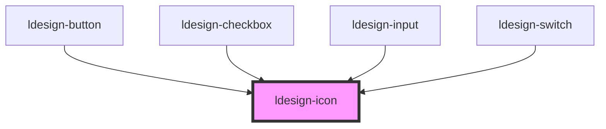

# ldesign-icon

<!-- Auto Generated Below -->

## Overview

Icon 图标组件
基于 Lucide 图标库

## Properties

| Property            | Attribute | Description | Type                                       | Default     |
| ------------------- | --------- | ----------- | ------------------------------------------ | ----------- |
| `color`             | `color`   | 图标颜色        | `string`                                   | `undefined` |
| `name` _(required)_ | `name`    | 图标名称        | `string`                                   | `undefined` |
| `size`              | `size`    | 图标尺寸        | `"large" \| "medium" \| "small" \| number` | `'medium'`  |
| `spin`              | `spin`    | 是否旋转        | `boolean`                                  | `false`     |

## Dependencies

### Used by

 - [ldesign-button](../button)
 - [ldesign-checkbox](../checkbox)
 - [ldesign-input](../input)
 - [ldesign-switch](../switch)

### Graph

----------------------------------------------

*Built with [StencilJS](https://stenciljs.com/)*
