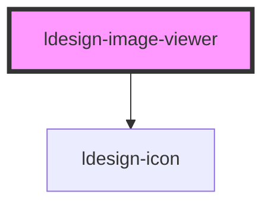

# ldesign-image-viewer

<!-- Auto Generated Below -->

## Overview

ImageViewer 图片预览器
- 支持多图预览、左右切换、循环
- 支持缩放（滚轮/按钮/双击）、拖拽平移、旋转、重置
- 支持顶部缩略图快速切换
- 支持键盘操作（Esc 关闭、←/→ 切换、+/- 缩放、0 重置）

## Properties

| Property              | Attribute         | Description        | Type                                      | Default     |
| --------------------- | ----------------- | ------------------ | ----------------------------------------- | ----------- |
| `backdrop`            | `backdrop`        | 主题：暗色/亮色遮罩         | `"dark" \| "light"`                       | `'dark'`    |
| `images` _(required)_ | `images`          | 图片列表（数组或 JSON 字符串） | `(string \| ImageViewerItem)[] \| string` | `undefined` |
| `keyboard`            | `keyboard`        | 是否启用键盘快捷键          | `boolean`                                 | `true`      |
| `loop`                | `loop`            | 是否循环播放             | `boolean`                                 | `true`      |
| `maskClosable`        | `mask-closable`   | 点击遮罩是否可关闭          | `boolean`                                 | `true`      |
| `maxScale`            | `max-scale`       |                    | `number`                                  | `4`         |
| `minScale`            | `min-scale`       | 最小/最大缩放            | `number`                                  | `0.25`      |
| `showThumbnails`      | `show-thumbnails` | 是否展示顶部缩略图          | `boolean`                                 | `true`      |
| `startIndex`          | `start-index`     | 初始索引               | `number`                                  | `0`         |
| `visible`             | `visible`         | 是否显示               | `boolean`                                 | `false`     |
| `wheelZoom`           | `wheel-zoom`      | 是否启用滚轮缩放           | `boolean`                                 | `true`      |
| `zIndex`              | `z-index`         | z-index            | `number`                                  | `1000`      |
| `zoomStep`            | `zoom-step`       | 缩放步进               | `number`                                  | `0.1`       |

## Events

| Event                  | Description | Type                              |
| ---------------------- | ----------- | --------------------------------- |
| `ldesignChange`        |             | `CustomEvent<{ index: number; }>` |
| `ldesignClose`         |             | `CustomEvent<void>`               |
| `ldesignOpen`          |             | `CustomEvent<void>`               |
| `ldesignVisibleChange` |             | `CustomEvent<boolean>`            |

## Dependencies

### Depends on

- [ldesign-icon](../icon)

### Graph

----------------------------------------------

*Built with [StencilJS](https://stenciljs.com/)*
