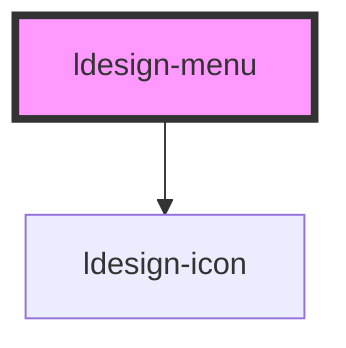

# ldesign-menu

数据驱动的菜单组件，支持：
- 横向/纵向两种展示模式
- 纵向两种子菜单交互：内嵌展开 inline、右侧弹出 flyout，以及混合 mixed（第一层内嵌，其余层级右侧弹出）
- 横向模式自动溢出处理：超出宽度时折叠为“更多”菜单
- 无限层级的多级菜单（数据结构递归）
- 可选 hover/click 触发子菜单
- 事件：选中、展开/收起、溢出变化

> 依赖 [ldesign-popup](../popup) 完成弹出定位。

## 基础用法（横向）

```html path=null start=null
<div style="max-width: 560px; border:1px dashed #ddd; padding:8px;">
  <ldesign-menu id="menu-horizontal" mode="horizontal"></ldesign-menu>
</div>
<script>
  const items = [
    { key: 'inbox', label: '消息区', icon: 'mail' },
    // 菜单1 无二级 -> 不显示箭头，但仍有图标
    { key: 'menu-1', label: '菜单1', icon: 'list' },
    // 菜单2 提供包含三级的示例数据
    { key: 'menu-2', label: '菜单2', icon: 'layout-list', children: [
      { key: 'm2-1', label: '子菜单2-1', children: [
        { key: 'm2-1-1', label: '子菜单2-1-1' },
        { key: 'm2-1-2', label: '子菜单2-1-2', children: [
          { key: 'm2-1-2-1', label: '子菜单2-1-2-1' },
          { key: 'm2-1-2-2', label: '子菜单2-1-2-2' }
        ] }
      ] },
      { key: 'm2-2', label: '子菜单2-2' }
    ] },
    { key: 'profile', label: '个人中心', icon: 'user' },
    { key: 'video', label: '视频区', icon: 'play-circle' },
    { key: 'editor', label: '资源编辑', icon: 'pen-tool' }
  ];
  document.getElementById('menu-horizontal').items = items;
</script>
```

在容器宽度不足时，多余的顶级菜单会自动收纳到“更多”中。

## 纵向 - 内嵌展开（inline）

```html path=null start=null
<ldesign-menu id="menu-inline" mode="vertical" vertical-expand="inline" accordion default-open-keys='["menu-1"]'></ldesign-menu>
<script>
  const items = [
    { key: 'menu-1', label: '二级菜单', children: [
      { key: 'a1', label: '二级菜单内容' },
      { key: 'a2', label: '二级菜单内容' },
      { key: 'a3', label: '二级菜单内容' }
    ]},
    { key: 'menu-2', label: '二级菜单', children: [
      { key: 'b1', label: '二级菜单内容' },
      { key: 'b2', label: '二级菜单内容' }
    ]},
    { key: 'profile', label: '个人中心', icon: 'user' },
    { key: 'video-zone', label: '视频区', icon: 'play' }
  ];
  document.getElementById('menu-inline').items = items;
</script>
```

- 设置 `vertical-expand="inline"` 表示采用内嵌展开。
- 设置 `accordion` 可使同层级仅保留一个展开。

## 纵向 - 右侧弹出（flyout）

```html path=null start=null
<ldesign-menu id="menu-fly" mode="vertical" vertical-expand="flyout" submenu-trigger="hover"></ldesign-menu>
<script>
  const items = [
    { key: 'catalog', label: '菜单1', children: [
      { key: 'g1', label: '子菜单1-1', children: new Array(10).fill(0).map((_,i)=>({key:'g1-'+i,label:'子菜单1-1-'+(i+1)})) },
      { key: 'g2', label: '子菜单1-2' }
    ]},
    { key: 'profile', label: '个人中心', icon: 'user' },
    { key: 'video', label: '视频区', icon: 'play' }
  ];
  document.getElementById('menu-fly').items = items;
</script>
```

- 设置 `vertical-expand="flyout"` 表示右侧弹出。
- `submenu-trigger` 可切换为 `click` 点击展开。

## 纵向 - 混合（第一层展开，其余层级右侧弹出）

```html path=null start=null
<ldesign-menu id="menu-mixed" mode="vertical" vertical-expand="mixed" default-open-keys='["menu-1"]'></ldesign-menu>
<script>
  const items = [
    { key: 'menu-1', label: '一级菜单', children: [
      { key: 'm11', label: '子菜单1-1', children: [
        { key: 'm111', label: '子菜单1-1-1' },
        { key: 'm112', label: '子菜单1-1-2' }
      ]},
      { key: 'm12', label: '子菜单1-2' }
    ]},
    { key: 'menu-2', label: '一级菜单2', children: [ { key: 'm21', label: '子菜单2-1' } ] }
  ];
  document.getElementById('menu-mixed').items = items;
</script>
```

## 事件绑定

```html path=null start=null
<ldesign-menu id="menu-events" mode="horizontal"></ldesign-menu>
<script>
  const items = [
    { key: 'home', label: '首页' },
    { key: 'docs', label: '文档', children: [{key:'d1',label:'快速上手'}] }
  ];
  const m = document.getElementById('menu-events');
  m.items = items;
  m.addEventListener('ldesignSelect', (e) => {
    console.log('select:', e.detail);
  });
  m.addEventListener('ldesignOpenChange', (e) => {
    console.log('open change:', e.detail);
  });
  m.addEventListener('ldesignOverflowChange', (e) => {
    console.log('overflow:', e.detail);
  });
</script>
```

## 属性（Props）
- items: MenuItem[] | string(JSON)
- mode: 'horizontal' | 'vertical' = 'vertical'
- vertical-expand: 'inline' | 'flyout' | 'mixed' = 'inline'
- submenu-trigger: 'hover' | 'click' = 'hover'
- value / default-value：当前选中项 key
- open-keys / default-open-keys：当前展开项（仅 inline/mixed）
- accordion: boolean
- indent: number = 16
- more-label: string = '更多'

## 事件（Events）
- ldesignSelect: { key, item, pathKeys }
- ldesignOpenChange: { key, open, openKeys }
- ldesignOverflowChange: { overflowCount }

> 下方为自动生成的属性/事件文档（构建后自动更新）。

<!-- Auto Generated Below -->


## Properties

| Property          | Attribute           | Description                                | Type                   | Default     |
| ----------------- | ------------------- | ------------------------------------------ | ---------------------- | ----------- |
| `accordion`       | `accordion`         | 手风琴模式：同层级只允许展开一个                           | `boolean`              | `false`     |
| `defaultOpenKeys` | `default-open-keys` | 默认打开的子菜单 key 列表（非受控）                       | `string[]`             | `[]`        |
| `defaultValue`    | `default-value`     | 默认选中项（非受控）                                 | `string`               | `undefined` |
| `indent`          | `indent`            | 子级缩进（px）                                   | `number`               | `16`        |
| `items`           | `items`             | 菜单数据（可传入 JSON 字符串或对象数组）                    | `MenuItem[] \| string` | `[]`        |
| `openKeys`        | `open-keys`         | 当前打开的子菜单 key 列表（受控）                        | `string[]`             | `undefined` |
| `requireTopIcon`  | `require-top-icon`  | 顶层（一级）是否强制显示图标占位（保证对齐）。若条目没有 icon，将渲染一个占位。 | `boolean`              | `true`      |
| `value`           | `value`             | 当前选中项（受控）                                  | `string`               | `undefined` |


## Events

| Event               | Description | Type                                                                |
| ------------------- | ----------- | ------------------------------------------------------------------- |
| `ldesignOpenChange` | 展开/收起事件     | `CustomEvent<{ key: string; open: boolean; openKeys: string[]; }>`  |
| `ldesignSelect`     | 选中事件        | `CustomEvent<{ key: string; item: MenuItem; pathKeys: string[]; }>` |


## Dependencies

### Depends on

- [ldesign-icon](../icon)

### Graph


----------------------------------------------

*Built with [StencilJS](https://stenciljs.com/)*
