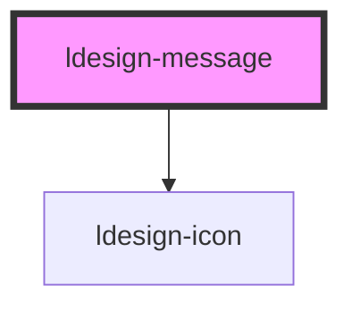

# ldesign-message

<!-- Auto Generated Below -->

## Overview

Message 全局提示
轻量级的全局反馈，常用于操作后的轻量提示

## Properties

| Property       | Attribute        | Description                  | Type                                          | Default     |
| -------------- | ---------------- | ---------------------------- | --------------------------------------------- | ----------- |
| `closable`     | `closable`       | 是否显示关闭按钮                     | `boolean`                                     | `false`     |
| `duration`     | `duration`       | 自动关闭的时长（毫秒）；设为 0 则不自动关闭      | `number`                                      | `3000`      |
| `message`      | `message`        | 简单文本内容（也可使用 slot 自定义内容）      | `string`                                      | `undefined` |
| `pauseOnHover` | `pause-on-hover` | 悬浮时是否暂停计时                    | `boolean`                                     | `true`      |
| `placement`    | `placement`      | 出现位置（当前仅支持 top，预留 bottom 扩展） | `"bottom" \| "top"`                           | `'top'`     |
| `showIcon`     | `show-icon`      | 是否显示图标                       | `boolean`                                     | `true`      |
| `type`         | `type`           | 提示类型                         | `"error" \| "info" \| "success" \| "warning"` | `'info'`    |

## Events

| Event          | Description | Type                |
| -------------- | ----------- | ------------------- |
| `ldesignClose` | 关闭事件        | `CustomEvent<void>` |

## Methods

### `close() => Promise<void>`

手动关闭（带高度收起动画，带动后续消息平滑上移）

#### Returns

Type: `Promise<void>`

## Dependencies

### Depends on

- [ldesign-icon](../icon)

### Graph

----------------------------------------------

*Built with [StencilJS](https://stenciljs.com/)*
