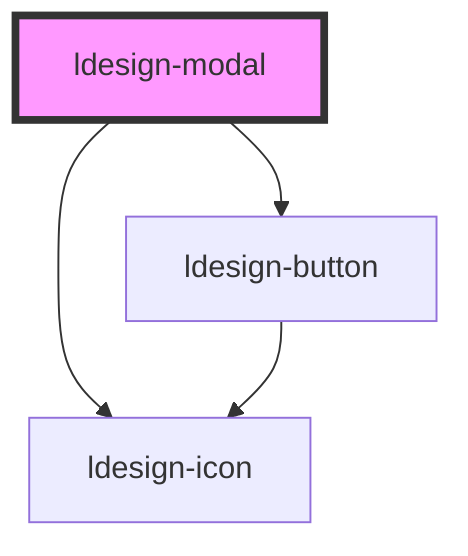

# ldesign-modal

<!-- Auto Generated Below -->

## Overview

Modal 模态框组件

## Properties

| Property         | Attribute          | Description | Type                                       | Default     |
| ---------------- | ------------------ | ----------- | ------------------------------------------ | ----------- |
| `centered`       | `centered`         | 是否居中显示      | `boolean`                                  | `false`     |
| `closable`       | `closable`         | 是否显示关闭按钮    | `boolean`                                  | `true`      |
| `destroyOnClose` | `destroy-on-close` | 是否销毁子元素     | `boolean`                                  | `false`     |
| `height`         | `height`           | 自定义高度       | `number \| string`                         | `undefined` |
| `isDraggable`    | `is-draggable`     | 是否可拖拽       | `boolean`                                  | `false`     |
| `keyboard`       | `keyboard`         | 按ESC键是否关闭   | `boolean`                                  | `true`      |
| `mask`           | `mask`             | 是否显示遮罩层     | `boolean`                                  | `true`      |
| `maskClosable`   | `mask-closable`    | 点击遮罩层是否关闭   | `boolean`                                  | `true`      |
| `modalTitle`     | `modal-title`      | 模态框标题       | `string`                                   | `undefined` |
| `resizable`      | `resizable`        | 是否可调整大小     | `boolean`                                  | `false`     |
| `size`           | `size`             | 模态框尺寸       | `"full" \| "large" \| "medium" \| "small"` | `'medium'`  |
| `top`            | `top`              | 距离顶部的距离     | `number \| string`                         | `undefined` |
| `visible`        | `visible`          | 是否显示模态框     | `boolean`                                  | `false`     |
| `width`          | `width`            | 自定义宽度       | `number \| string`                         | `undefined` |
| `zIndex`         | `z-index`          | z-index     | `number`                                   | `1000`      |

## Events

| Event                  | Description | Type                   |
| ---------------------- | ----------- | ---------------------- |
| `ldesignClose`         | 关闭事件        | `CustomEvent<void>`    |
| `ldesignOk`            | 确认事件        | `CustomEvent<void>`    |
| `ldesignVisibleChange` | 显示状态变化事件    | `CustomEvent<boolean>` |

## Dependencies

### Depends on

- [ldesign-icon](../icon)
- [ldesign-button](../button)

### Graph

----------------------------------------------

*Built with [StencilJS](https://stenciljs.com/)*
