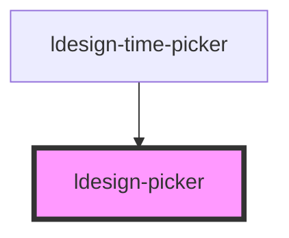

# ldesign-picker

## 示例：外部改变选中值并观察滚动动画

从外部改变 `value` 时，组件会平滑滚动到新位置而不是瞬间跳变。你也可以通过公开方法 `scrollToValue` 控制是否启用动画以及是否静默（不触发变更事件）。

示例（可直接在文档中试用）：

```html
<!-- 左：ldesign-picker；右：原生 select，选择右侧会同步左侧 -->
<div style="display:flex; gap:16px; align-items:flex-start;">
  <ldesign-picker
    id="pk-external"
    size="medium"
    visible-items="5"
    options='[{"value":"a","label":"A"},{"value":"b","label":"B"},{"value":"c","label":"C"},{"value":"d","label":"D"},{"value":"e","label":"E"}]'
    value="c"
  ></ldesign-picker>

  <select id="pk-external-select" style="width:120px;">
    <option value="a">A</option>
    <option value="b">B</option>
    <option value="c" selected>C</option>
    <option value="d">D</option>
    <option value="e">E</option>
  </select>
</div>

<div style="margin-top:12px; display:flex; gap:8px; flex-wrap:wrap; align-items:center;">
  <button id="btn-attr-prev">属性 value 上一个</button>
  <button id="btn-attr-next">属性 value 下一个</button>
  <button id="btn-method-prev">方法 scrollToValue 上一个</button>
  <button id="btn-method-next">方法 scrollToValue 下一个</button>
  <label style="margin-left:12px;">
    <input type="checkbox" id="toggle-animate" checked /> animate
  </label>
  <label>
    <input type="checkbox" id="toggle-silent" /> silent
  </label>
</div>

<script type="module">
  const el = document.getElementById('pk-external');
  const selectEl = document.getElementById('pk-external-select');

  const values = ['a','b','c','d','e'];
  const idxOf = v => values.indexOf(v);
  const nextOf = v => values[Math.min(values.length - 1, idxOf(v) + 1)] ?? values[values.length - 1];
  const prevOf = v => values[Math.max(0, idxOf(v) - 1)] ?? values[0];

  function getAnimate() { return document.getElementById('toggle-animate').checked; }
  function getSilent() { return document.getElementById('toggle-silent').checked; }

  // 右侧 select -> 左侧 picker
  selectEl.addEventListener('change', () => {
    el.value = selectEl.value;
  });

  // 方式A：外部修改 value 属性（会触发平滑滚动，内部为静默，不触发 ldesignChange）
  document.getElementById('btn-attr-prev').addEventListener('click', () => {
    const v = el.value ?? values[0];
    const nv = prevOf(v);
    el.value = nv; // 设置属性 value，即受控用法
    selectEl.value = nv; // 同步右侧
  });
  document.getElementById('btn-attr-next').addEventListener('click', () => {
    const v = el.value ?? values[0];
    const nv = nextOf(v);
    el.value = nv;
    selectEl.value = nv; // 同步右侧
  });

  // 方式B：调用公开方法 scrollToValue，可自定义动画与是否静默
  document.getElementById('btn-method-prev').addEventListener('click', async () => {
    const v = el.value ?? values[0];
    const nv = prevOf(v);
    await el.scrollToValue(nv, { animate: getAnimate(), silent: getSilent(), trigger: 'program' });
    selectEl.value = nv; // 同步右侧
  });
  document.getElementById('btn-method-next').addEventListener('click', async () => {
    const v = el.value ?? values[0];
    const nv = nextOf(v);
    await el.scrollToValue(nv, { animate: getAnimate(), silent: getSilent(), trigger: 'program' });
    selectEl.value = nv; // 同步右侧
  });

  // 可选：观察事件
  el.addEventListener('ldesignChange', e => console.log('ldesignChange', e.detail));
  el.addEventListener('ldesignPick', e => console.log('ldesignPick', e.detail));
</script>
```

提示
- 修改 `value` 属性：默认静默（不触发 `ldesignChange`），用于受控场景以避免双向循环。
- 调用 `scrollToValue(value, { animate, silent })`：可按需开启/关闭动画与静默。
- 通过 `snap-duration` 与 `snap-duration-wheel` 可调整滚动吸附动画时长。

<!-- Auto Generated Below -->


## Overview

ldesign-picker
通用滚轮选择器（单列）
- PC：鼠标滚轮按“行”步进，按速度取整步数
- 移动端：手势滑动（Pointer Events）+ 惯性 + 吸附到最近项
- 支持配置容器高度与每项高度；容器通常为 itemHeight 的奇数倍（3/5/7...）
- 正中间指示器高度与子项一致

## Properties

| Property             | Attribute              | Description                                              | Type                             | Default     |
| -------------------- | ---------------------- | -------------------------------------------------------- | -------------------------------- | ----------- |
| `defaultValue`       | `default-value`        | 默认值（非受控）                                                 | `string`                         | `undefined` |
| `disabled`           | `disabled`             | 是否禁用                                                     | `boolean`                        | `false`     |
| `dragFollow`         | `drag-follow`          | 手势拖拽跟随比例（0-1），1 表示 1:1 跟手，越小阻力越大，默认 1                    | `number`                         | `1`         |
| `dragSmoothing`      | `drag-smoothing`       | 手势拖拽平滑时间常数（毫秒），>0 时使用一阶平滑使位移逐步接近手指，营造“越来越慢”的阻力感，默认 0（关闭） | `number`                         | `undefined` |
| `friction`           | `friction`             | 惯性摩擦 0-1（越小减速越快）                                         | `number`                         | `0.92`      |
| `itemHeight`         | `item-height`          | 行高（自动根据 size 推导，亦可显式覆盖）                                  | `number`                         | `undefined` |
| `maxOverscroll`      | `max-overscroll`       | 最大橡皮筋越界（像素）。优先级高于比例                                      | `number`                         | `undefined` |
| `maxOverscrollRatio` | `max-overscroll-ratio` | 最大橡皮筋越界比例（相对于容器高度 0-1）。当未提供像素值时生效；未设置则默认 0.5（即容器高度的一半）   | `number`                         | `undefined` |
| `momentum`           | `momentum`             | 是否启用惯性                                                   | `boolean`                        | `true`      |
| `options`            | `options`              | 选项列表（数组或 JSON 字符串）                                       | `PickerOption[] \| string`       | `[]`        |
| `panelHeight`        | `panel-height`         | 可视高度（优先），未设置时使用 visibleItems * itemHeight                | `number`                         | `undefined` |
| `resistance`         | `resistance`           | 边界阻力系数 0-1（越小阻力越大）                                       | `number`                         | `0.35`      |
| `size`               | `size`                 | 尺寸，影响每行高度                                                | `"large" \| "medium" \| "small"` | `'medium'`  |
| `snapDuration`       | `snap-duration`        | 吸附/回弹动画时长（毫秒，适用于触摸/键盘/滚动吸附），未设置默认 260ms                  | `number`                         | `undefined` |
| `snapDurationWheel`  | `snap-duration-wheel`  | 滚轮专用吸附动画时长（毫秒），未设置默认 150ms                               | `number`                         | `undefined` |
| `value`              | `value`                | 当前值（受控）                                                  | `string`                         | `undefined` |
| `visibleItems`       | `visible-items`        | 可视条目数（未显式 panelHeight 时生效，建议奇数：3/5/7）                    | `number`                         | `5`         |


## Events

| Event           | Description        | Type                                                                                                                                     |
| --------------- | ------------------ | ---------------------------------------------------------------------------------------------------------------------------------------- |
| `ldesignChange` | 选中项变化（最终吸附后触发）     | `CustomEvent<{ value: string; option?: PickerOption; }>`                                                                                 |
| `ldesignPick`   | 选择过程事件（滚动/拖拽中也会触发） | `CustomEvent<{ value: string; option?: PickerOption; context: { trigger: "scroll" \| "click" \| "wheel" \| "keyboard" \| "touch"; }; }>` |


## Methods

### `centerToCurrent(smooth?: boolean) => Promise<void>`


#### Parameters

| Name     | Type      | Description |
| -------- | --------- | ----------- |
| `smooth` | `boolean` |             |

#### Returns

Type: `Promise<void>`


### `scrollToIndex(index: number, opts?: { trigger?: "program" | "click" | "scroll" | "wheel" | "keyboard" | "touch"; animate?: boolean; silent?: boolean; }) => Promise<void>`


#### Parameters

| Name    | Type                                                                                                                       | Description |
| ------- | -------------------------------------------------------------------------------------------------------------------------- | ----------- |
| `index` | `number`                                                                                                                   |             |
| `opts`  | `{ trigger?: "scroll" \| "click" \| "wheel" \| "keyboard" \| "touch" \| "program"; animate?: boolean; silent?: boolean; }` |             |

#### Returns

Type: `Promise<void>`


### `scrollToValue(value: string, opts?: { trigger?: "program" | "click" | "scroll" | "wheel" | "keyboard" | "touch"; animate?: boolean; silent?: boolean; }) => Promise<void>`


#### Parameters

| Name    | Type                                                                                                                       | Description |
| ------- | -------------------------------------------------------------------------------------------------------------------------- | ----------- |
| `value` | `string`                                                                                                                   |             |
| `opts`  | `{ trigger?: "scroll" \| "click" \| "wheel" \| "keyboard" \| "touch" \| "program"; animate?: boolean; silent?: boolean; }` |             |

#### Returns

Type: `Promise<void>`


## Dependencies

### Used by

 - [ldesign-time-picker](../time-picker)

### Graph


----------------------------------------------

*Built with [StencilJS](https://stenciljs.com/)*
