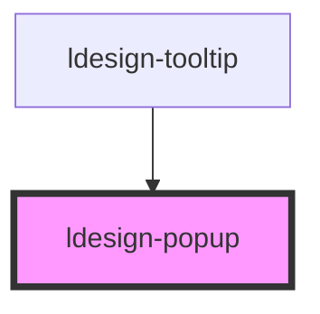

# ldesign-popup

<!-- Auto Generated Below -->

## Overview

Popup 弹出层组件
基于

## Properties

| Property         | Attribute          | Description                         | Type                                                                                                                                                                 | Default     |
| ---------------- | ------------------ | ----------------------------------- | -------------------------------------------------------------------------------------------------------------------------------------------------------------------- | ----------- |
| `arrow`          | `arrow`            | 是否显示箭头                              | `boolean`                                                                                                                                                            | `true`      |
| `closeOnEsc`     | `close-on-esc`     | 是否允许 Esc 键关闭                        | `boolean`                                                                                                                                                            | `true`      |
| `closeOnOutside` | `close-on-outside` | 点击浮层外是否关闭（仅在 trigger = 'click' 时常用） | `boolean`                                                                                                                                                            | `true`      |
| `content`        | `content`          | 弹出层内容                               | `string`                                                                                                                                                             | `undefined` |
| `disabled`       | `disabled`         | 是否禁用                                | `boolean`                                                                                                                                                            | `false`     |
| `hideDelay`      | `hide-delay`       | 延迟隐藏时间（毫秒）                          | `number`                                                                                                                                                             | `0`         |
| `interactive`    | `interactive`      | 是否允许在弹出层上进行交互（仅 hover 触发时有意义）       | `boolean`                                                                                                                                                            | `true`      |
| `maxWidth`       | `max-width`        | 最大宽度                                | `number \| string`                                                                                                                                                   | `undefined` |
| `offsetDistance` | `offset-distance`  | 偏移量                                 | `number`                                                                                                                                                             | `8`         |
| `placement`      | `placement`        | 弹出层位置                               | `"bottom" \| "bottom-end" \| "bottom-start" \| "left" \| "left-end" \| "left-start" \| "right" \| "right-end" \| "right-start" \| "top" \| "top-end" \| "top-start"` | `'bottom'`  |
| `popupRole`      | `popup-role`       | 内容区域的语义角色                           | `string`                                                                                                                                                             | `'dialog'`  |
| `popupTitle`     | `popup-title`      | 弹出层标题                               | `string`                                                                                                                                                             | `undefined` |
| `showDelay`      | `show-delay`       | 延迟显示时间（毫秒）                          | `number`                                                                                                                                                             | `0`         |
| `theme`          | `theme`            | 主题风格                                | `"dark" \| "light"`                                                                                                                                                  | `'light'`   |
| `trigger`        | `trigger`          | 触发方式                                | `"click" \| "contextmenu" \| "focus" \| "hover" \| "manual"`                                                                                                         | `'hover'`   |
| `visible`        | `visible`          | 是否显示弹出层                             | `boolean`                                                                                                                                                            | `false`     |
| `width`          | `width`            | 弹出层宽度                               | `number \| string`                                                                                                                                                   | `undefined` |

## Events

| Event                  | Description | Type                   |
| ---------------------- | ----------- | ---------------------- |
| `ldesignVisibleChange` | 显示状态变化事件    | `CustomEvent<boolean>` |

## Dependencies

### Used by

 - [ldesign-tooltip](../tooltip)

### Graph

----------------------------------------------

*Built with [StencilJS](https://stenciljs.com/)*
