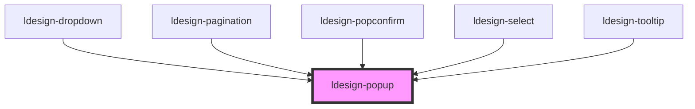

# ldesign-popup

Popup 弹出层组件（不覆盖触发元素）

- 默认不会遮挡触发元素。
- 通过 `offset-distance` 设置“触发元素到箭头尖端”的距离（默认 8px）。
- 可选 `lock-on-scroll`：点击打开后滚动页面时，弹层保持打开时的视口位置，不随触发元素移动。

## 不遮挡触发元素与距离设置

- 本组件基于 `@floating-ui/dom` 进行定位，使用 `offset-distance` 作为触发元素与弹层之间的间距。
- 当 `arrow=true` 时，箭头会向外突出 4px；组件已自动将这 4px 计入计算，使得“箭头尖端到触发元素”的实际间距严格等于 `offset-distance`。
- 当 `arrow=false` 时，`offset-distance` 即“弹层边缘到触发元素”的距离。

示例：

- 带箭头，距离 12px：

```html
<ldesign-popup placement="top" offset-distance="12" content="这是一个弹出层">
  <button slot="trigger">悬停显示</button>
</ldesign-popup>
```

- 不带箭头，仍保持 12px 间距：

```html
<ldesign-popup placement="top" arrow="false" offset-distance="12" content="这是一个弹出层">
  <button slot="trigger">悬停显示</button>
</ldesign-popup>
```

- 复杂滚动/裁剪容器，建议将弹层渲染到 `body`，避免被裁剪：

```html
<ldesign-popup append-to="body" placement="bottom" offset-distance="8" content="放到 body 下渲染">
  <button slot="trigger">触发</button>
</ldesign-popup>
```

> 提示：属性在模板中使用短横线写法（`offset-distance`），在 JS/TS 中对应为 `offsetDistance`。

<!-- Auto Generated Below -->


## Overview

Popup 弹出层组件
基于

## Properties

| Property         | Attribute          | Description                                                                                                                     | Type                                                                                                                                                                 | Default     |
| ---------------- | ------------------ | ------------------------------------------------------------------------------------------------------------------------------- | -------------------------------------------------------------------------------------------------------------------------------------------------------------------- | ----------- |
| `appendTo`       | `append-to`        | 弹层渲染容器 - self: 渲染在组件内部（默认） - body: 渲染在 document.body 下，常用于复杂布局/滚动容器 - closest-popup: 渲染到最近的上层 .ldesign-popup__content 内（用于嵌套弹层） | `"body" \| "closest-popup" \| "self"`                                                                                                                                | `'self'`    |
| `arrow`          | `arrow`            | 是否显示箭头                                                                                                                          | `boolean`                                                                                                                                                            | `true`      |
| `closeOnEsc`     | `close-on-esc`     | 是否允许 Esc 键关闭                                                                                                                    | `boolean`                                                                                                                                                            | `true`      |
| `closeOnOutside` | `close-on-outside` | 点击浮层外是否关闭（仅在 trigger = 'click' 时常用）                                                                                             | `boolean`                                                                                                                                                            | `true`      |
| `content`        | `content`          | 弹出层内容                                                                                                                           | `string`                                                                                                                                                             | `undefined` |
| `disabled`       | `disabled`         | 是否禁用                                                                                                                            | `boolean`                                                                                                                                                            | `false`     |
| `hideDelay`      | `hide-delay`       | 延迟隐藏时间（毫秒）                                                                                                                      | `number`                                                                                                                                                             | `0`         |
| `interactive`    | `interactive`      | 是否允许在弹出层上进行交互（仅 hover 触发时有意义）                                                                                                   | `boolean`                                                                                                                                                            | `true`      |
| `lockOnScroll`   | `lock-on-scroll`   | 滚动时是否锁定位置（不随滚动而重新定位）。 - 适用于 click 等场景：打开后滚动页面，弹层保持在打开时的视口位置。 - 仅影响滚动行为，仍会在窗口尺寸变化/元素尺寸变化时更新位置。                                   | `boolean`                                                                                                                                                            | `false`     |
| `maxWidth`       | `max-width`        | 最大宽度                                                                                                                            | `number \| string`                                                                                                                                                   | `undefined` |
| `offsetDistance` | `offset-distance`  | 与触发元素的距离（单位 px）。 当开启箭头时，该距离表示“触发元素到箭头尖端”的间隙。                                                                                    | `number \| string`                                                                                                                                                   | `8`         |
| `placement`      | `placement`        | 弹出层位置                                                                                                                           | `"bottom" \| "bottom-end" \| "bottom-start" \| "left" \| "left-end" \| "left-start" \| "right" \| "right-end" \| "right-start" \| "top" \| "top-end" \| "top-start"` | `'bottom'`  |
| `popupRole`      | `popup-role`       | 内容区域的语义角色                                                                                                                       | `string`                                                                                                                                                             | `'dialog'`  |
| `popupTitle`     | `popup-title`      | 弹出层标题                                                                                                                           | `string`                                                                                                                                                             | `undefined` |
| `showDelay`      | `show-delay`       | 延迟显示时间（毫秒）                                                                                                                      | `number`                                                                                                                                                             | `0`         |
| `strategy`       | `strategy`         | 定位策略 - auto: 自动检测（默认：嵌套在其他弹层内部时使用 absolute，否则使用 fixed） - fixed: 始终使用 fixed（相对视口） - absolute: 始终使用 absolute（相对最近定位的包含块）          | `"absolute" \| "auto" \| "fixed"`                                                                                                                                    | `'auto'`    |
| `theme`          | `theme`            | 主题风格                                                                                                                            | `"dark" \| "light"`                                                                                                                                                  | `'light'`   |
| `trigger`        | `trigger`          | 触发方式                                                                                                                            | `"click" \| "contextmenu" \| "focus" \| "hover" \| "manual"`                                                                                                         | `'hover'`   |
| `visible`        | `visible`          | 是否显示弹出层                                                                                                                         | `boolean`                                                                                                                                                            | `false`     |
| `width`          | `width`            | 弹出层宽度                                                                                                                           | `number \| string`                                                                                                                                                   | `undefined` |


## Events

| Event                  | Description | Type                   |
| ---------------------- | ----------- | ---------------------- |
| `ldesignVisibleChange` | 显示状态变化事件    | `CustomEvent<boolean>` |


## Dependencies

### Used by

 - [ldesign-dropdown](../dropdown)
 - [ldesign-pagination](../pagination)
 - [ldesign-popconfirm](../popconfirm)
 - [ldesign-select](../select)
 - [ldesign-tooltip](../tooltip)

### Graph


----------------------------------------------

*Built with [StencilJS](https://stenciljs.com/)*
