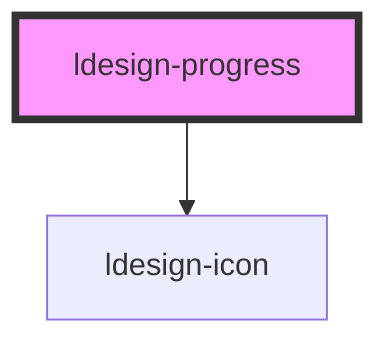

# ldesign-progress

<!-- Auto Generated Below -->

## Overview

Progress 进度条
支持：线形、环形、仪表盘、步骤条，多尺寸/状态/文本/自定义颜色等

## Properties

| Property              | Attribute                | Description                                                | Type                                                           | Default                                   |
| --------------------- | ------------------------ | ---------------------------------------------------------- | -------------------------------------------------------------- | ----------------------------------------- |
| `circleStepGapDegree` | `circle-step-gap-degree` | 圆形分段之间的间隔角度（度数）                                            | `number`                                                       | `2`                                       |
| `circleSteps`         | `circle-steps`           | 圆形分段步数（用于环形步进样式）                                           | `number`                                                       | `undefined`                               |
| `format`              | `format`                 | 文本格式化，使用 {percent} 占位符，例如："{percent} / 100"                | `string`                                                       | `'{percent}%'`                            |
| `gapDegree`           | `gap-degree`             | 仪表盘缺口角度（0-360，仅 circle/dashboard）                          | `number`                                                       | `undefined`                               |
| `gapPosition`         | `gap-position`           | 缺口位置（top/right/bottom/left，仅 circle/dashboard）             | `"bottom" \| "left" \| "right" \| "top"`                       | `'top'`                                   |
| `gradientDirection`   | `gradient-direction`     | 渐变方向：horizontal \| vertical \| diagonal                    | `"diagonal" \| "horizontal" \| "vertical"`                     | `'horizontal'`                            |
| `gradientFrom`        | `gradient-from`          | 环形渐变（可选，仅 circle/dashboard）：起止色                            | `string`                                                       | `undefined`                               |
| `gradientTo`          | `gradient-to`            |                                                            | `string`                                                       | `undefined`                               |
| `infoPosition`        | `info-position`          | 线形文本位置                                                     | `"bottom" \| "inside" \| "left" \| "right"`                    | `'right'`                                 |
| `percent`             | `percent`                | 百分比 0-100                                                  | `number`                                                       | `0`                                       |
| `semiPosition`        | `semi-position`          | 半圆位置（type=semicircle），top 表示显示上半圆，bottom 表示下半圆             | `"bottom" \| "top"`                                            | `'top'`                                   |
| `showInfo`            | `show-info`              | 是否显示信息文本（line：默认右侧；circle/dashboard：内部）                    | `boolean`                                                      | `true`                                    |
| `size`                | `size`                   | 组件尺寸                                                       | `"large" \| "medium" \| "middle" \| "small"`                   | `'medium'`                                |
| `status`              | `status`                 | 状态：normal \| active \| success \| exception                | `"active" \| "exception" \| "normal" \| "success"`             | `'normal'`                                |
| `steps`               | `steps`                  | 步骤数（type=steps 或设置 steps>0 都渲染步骤条）                         | `number`                                                       | `undefined`                               |
| `stepsGap`            | `steps-gap`              | 步骤间隙 px（仅 steps）                                           | `number`                                                       | `2`                                       |
| `stepsRadius`         | `steps-radius`           | 步骤条的块圆角                                                    | `number`                                                       | `100`                                     |
| `striped`             | `striped`                | 条纹动画（active 状态下默认开启）                                       | `boolean`                                                      | `true`                                    |
| `strokeColor`         | `stroke-color`           | 进度颜色（可为任意 css 颜色）                                          | `string`                                                       | `undefined`                               |
| `strokeLinecap`       | `stroke-linecap`         | 端点样式：round \| square \| butt（仅 circle 有效，line 以圆角呈现 round） | `"butt" \| "round" \| "square"`                                | `'round'`                                 |
| `strokeWidth`         | `stroke-width`           | 线宽（line 为高度，circle 为描边宽度）                                  | `number`                                                       | `undefined`                               |
| `successColor`        | `success-color`          | 成功颜色                                                       | `string`                                                       | `'var(--ldesign-success-color, #42bd42)'` |
| `successPercent`      | `success-percent`        | 成功进度（用于分段显示成功部分）0-100                                      | `number`                                                       | `undefined`                               |
| `trailColor`          | `trail-color`            | 未完成轨道颜色                                                    | `string`                                                       | `undefined`                               |
| `type`                | `type`                   | 类型：line（默认）\| circle \| dashboard \| steps \| semicircle   | `"circle" \| "dashboard" \| "line" \| "semicircle" \| "steps"` | `'line'`                                  |
| `width`               | `width`                  | 外径宽度（仅 circle/dashboard），单位 px                             | `number`                                                       | `120`                                     |

## Dependencies

### Depends on

- [ldesign-icon](../icon)

### Graph

----------------------------------------------

*Built with [StencilJS](https://stenciljs.com/)*
