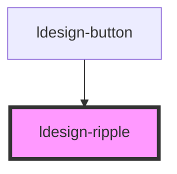

# ldesign-ripple

<!-- Auto Generated Below -->

## Overview

Ripple 水波纹效果
用法：把 <ldesign-ripple /> 放入任意元素内部（建议放最后），即可在该元素上获得点击水波纹效果。
例如：
<button class="btn">按钮<ldesign-ripple /></button>

## Properties

| Property          | Attribute           | Description          | Type                                      | Default                          |
| ----------------- | ------------------- | -------------------- | ----------------------------------------- | -------------------------------- |
| `centered`        | `centered`          | 是否居中触发               | `boolean`                                 | `false`                          |
| `color`           | `color`             | 波纹颜色，默认 currentColor | `string`                                  | `undefined`                      |
| `disabled`        | `disabled`          | 禁用                   | `boolean`                                 | `false`                          |
| `duration`        | `duration`          | 膨胀动画时长(ms)           | `number`                                  | `600`                            |
| `easing`          | `easing`            | 缓动函数                 | `string`                                  | `'cubic-bezier(0.4, 0, 0.2, 1)'` |
| `fadeOutDuration` | `fade-out-duration` | 淡出时长(ms)             | `number`                                  | `300`                            |
| `maxRipples`      | `max-ripples`       | 同时存在的最大波纹数量          | `number`                                  | `8`                              |
| `opacity`         | `opacity`           | 波纹不透明度               | `number`                                  | `0.24`                           |
| `radius`          | `radius`            | 半径：auto 或固定像素        | `"auto" \| number`                        | `'auto'`                         |
| `touchEnabled`    | `touch-enabled`     | 是否允许触摸设备             | `boolean`                                 | `true`                           |
| `trigger`         | `trigger`           | 触发方式                 | `"click" \| "mousedown" \| "pointerdown"` | `'pointerdown'`                  |
| `unbounded`       | `unbounded`         | 是否不裁剪边界              | `boolean`                                 | `false`                          |

## Dependencies

### Used by

 - [ldesign-button](../button)

### Graph

----------------------------------------------

*Built with [StencilJS](https://stenciljs.com/)*
