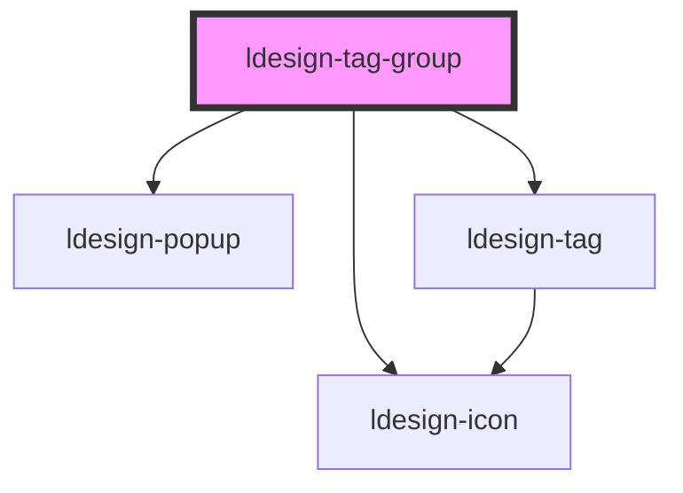

# ldesign-tag-group

<!-- Auto Generated Below -->

## Overview

TagGroup 标签组
- overflow="scroll" 提供横向滚动和可选箭头
- overflow="more" 根据 maxVisible 折叠为 +N，并使用 ldesign-popup 展示剩余项

## Properties

| Property     | Attribute     | Description                      | Type                 | Default    |
| ------------ | ------------- | -------------------------------- | -------------------- | ---------- |
| `maxVisible` | `max-visible` | more 模式下最多展示的项数（超出将折叠）           | `number`             | `5`        |
| `morePrefix` | `more-prefix` | more 展示文本前缀，例如 "+"               | `string`             | `'+'`      |
| `overflow`   | `overflow`    | 溢出策略：scroll（水平滚动） \| more（+N 收纳） | `"more" \| "scroll"` | `'scroll'` |
| `scrollStep` | `scroll-step` | 滚动步长（像素）                         | `number`             | `120`      |
| `showArrows` | `show-arrows` | 是否显示滚动箭头（仅 overflow=scroll 时生效）  | `boolean`            | `true`     |

## Dependencies

### Depends on

- [ldesign-icon](../icon)
- [ldesign-popup](../popup)
- [ldesign-tag](../tag)

### Graph

----------------------------------------------

*Built with [StencilJS](https://stenciljs.com/)*
