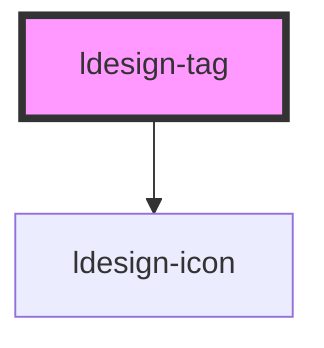

# ldesign-tag

## 使用示例

- 基础用法
```html
<ldesign-tag>默认标签</ldesign-tag>
<ldesign-tag color="primary">Primary</ldesign-tag>
<ldesign-tag color="success">Success</ldesign-tag>
<ldesign-tag color="warning">Warning</ldesign-tag>
<ldesign-tag color="danger">Danger</ldesign-tag>
```

- 外观（variant）
```html
<ldesign-tag color="primary" variant="light">Light</ldesign-tag>
<ldesign-tag color="primary" variant="solid">Solid</ldesign-tag>
<ldesign-tag color="primary" variant="outline">Outline</ldesign-tag>
```

- 可关闭
```html
<ldesign-tag color="primary" closable>可关闭</ldesign-tag>
```

- 尺寸与形状
```html
<ldesign-tag size="small">Small</ldesign-tag>
<ldesign-tag size="middle">Middle</ldesign-tag>
<ldesign-tag size="large">Large</ldesign-tag>

<ldesign-tag shape="round">圆角</ldesign-tag>
<ldesign-tag shape="rectangle">默认</ldesign-tag>
```

- 带图标
```html
<ldesign-tag icon="tag">标签</ldesign-tag>
<ldesign-tag icon="check" color="success">完成</ldesign-tag>
```

> 下方为自动生成的属性与事件文档，构建后会自动更新。

<!-- Auto Generated Below -->


## Overview

Tag 标签组件
用于标记和分类

## Properties

| Property   | Attribute  | Description                                      | Type                                                           | Default       |
| ---------- | ---------- | ------------------------------------------------ | -------------------------------------------------------------- | ------------- |
| `closable` | `closable` | 是否可关闭                                            | `boolean`                                                      | `false`       |
| `color`    | `color`    | 语义颜色                                             | `"danger" \| "default" \| "primary" \| "success" \| "warning"` | `'default'`   |
| `disabled` | `disabled` | 是否禁用                                             | `boolean`                                                      | `false`       |
| `icon`     | `icon`     | 左侧图标                                             | `string`                                                       | `undefined`   |
| `shape`    | `shape`    | 形状                                               | `"rectangle" \| "round"`                                       | `'rectangle'` |
| `size`     | `size`     | 尺寸                                               | `"large" \| "medium" \| "middle" \| "small"`                   | `'middle'`    |
| `variant`  | `variant`  | 外观风格 - light: 浅色背景（默认） - solid: 实底 - outline: 描边 | `"light" \| "outline" \| "solid"`                              | `'light'`     |


## Events

| Event          | Description | Type                      |
| -------------- | ----------- | ------------------------- |
| `ldesignClose` | 关闭事件        | `CustomEvent<MouseEvent>` |


## Dependencies

### Depends on

- [ldesign-icon](../icon)

### Graph


----------------------------------------------

*Built with [StencilJS](https://stenciljs.com/)*
