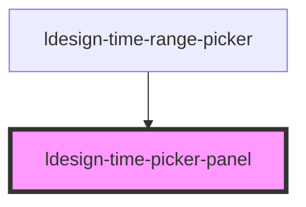

# ldesign-time-picker-panel

<!-- Auto Generated Below -->

## Overview

ldesign-time-picker-panel
仅渲染选择面板，不包含触发器/弹层

## Properties

| Property           | Attribute            | Description                   | Type                                                                   | Default        |
| ------------------ | -------------------- | ----------------------------- | ---------------------------------------------------------------------- | -------------- |
| `defaultValue`     | `default-value`      | 默认值                           | `string`                                                               | `undefined`    |
| `disabledHours`    | `disabled-hours`     |                               | `number[] \| string`                                                   | `undefined`    |
| `disabledMinutes`  | `disabled-minutes`   |                               | `number[] \| string`                                                   | `undefined`    |
| `disabledSeconds`  | `disabled-seconds`   |                               | `number[] \| string`                                                   | `undefined`    |
| `format`           | `format`             | 时间格式                          | `"HH:mm" \| "HH:mm:ss" \| "HH:mm:ss:SSS" \| "hh:mm A" \| "hh:mm:ss A"` | `'HH:mm:ss'`   |
| `hideDisabledTime` | `hide-disabled-time` |                               | `boolean`                                                              | `true`         |
| `maxTime`          | `max-time`           |                               | `string`                                                               | `undefined`    |
| `minTime`          | `min-time`           | 限制与禁用（可选）                     | `string`                                                               | `undefined`    |
| `panelHeight`      | `panel-height`       | 面板列最大高度                       | `number`                                                               | `180`          |
| `showSeconds`      | `show-seconds`       | 是否显示秒                         | `boolean`                                                              | `true`         |
| `steps`            | `steps`              | 步进数组 [h, m, s, ms]            | `number[]`                                                             | `[1, 1, 1, 1]` |
| `use12Hours`       | `use-1-2-hours`      | 是否启用 12 小时制显示（输出仍用 format 决定） | `boolean`                                                              | `false`        |
| `value`            | `value`              | 当前值（受控）                       | `string`                                                               | `undefined`    |
| `visibleItems`     | `visible-items`      | 可视条目数（当未显式指定 panelHeight 时生效） | `number`                                                               | `5`            |

## Events

| Event           | Description | Type                                                                                                 |
| --------------- | ----------- | ---------------------------------------------------------------------------------------------------- |
| `ldesignChange` | 变更事件        | `CustomEvent<string>`                                                                                |
| `ldesignPick`   | 选择事件        | `CustomEvent<{ value: string; context: { trigger: "scroll" \| "click" \| "keyboard" \| "now"; }; }>` |

## Dependencies

### Used by

 - [ldesign-time-range-picker](../time-range-picker)

### Graph

----------------------------------------------

*Built with [StencilJS](https://stenciljs.com/)*
