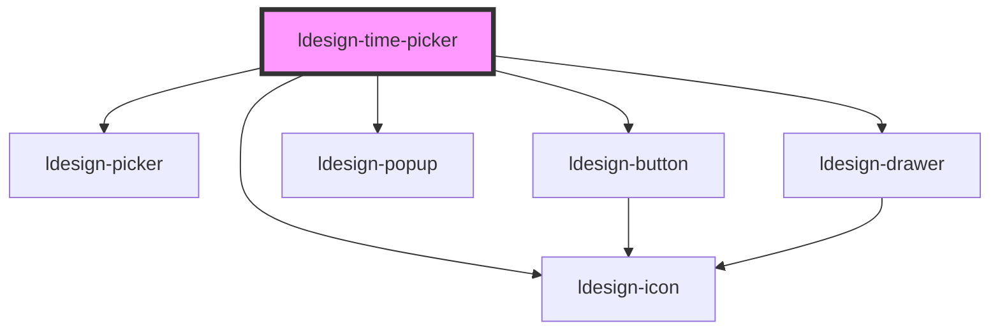

# ldesign-time-picker

<!-- Auto Generated Below -->

## Properties

| Property          | Attribute          | Description | Type                                                                                                                                                                 | Default                       |
| ----------------- | ------------------ | ----------- | -------------------------------------------------------------------------------------------------------------------------------------------------------------------- | ----------------------------- |
| `breakpoints`     | `breakpoints`      |             | `{ xs: number; sm: number; md: number; lg: number; }`                                                                                                                | `undefined`                   |
| `confirm`         | `confirm`          |             | `boolean`                                                                                                                                                            | `true`                        |
| `defaultValue`    | `default-value`    |             | `string`                                                                                                                                                             | `undefined`                   |
| `disabled`        | `disabled`         |             | `boolean`                                                                                                                                                            | `false`                       |
| `drawerPlacement` | `drawer-placement` |             | `"bottom" \| "left" \| "right" \| "top"`                                                                                                                             | `'bottom'`                    |
| `drawerSize`      | `drawer-size`      |             | `number \| string`                                                                                                                                                   | `undefined`                   |
| `drawerTitle`     | `drawer-title`     |             | `string`                                                                                                                                                             | `undefined`                   |
| `overlay`         | `overlay`          |             | `"auto" \| "drawer" \| "popup"`                                                                                                                                      | `'auto'`                      |
| `panelHeight`     | `panel-height`     |             | `number`                                                                                                                                                             | `180`                         |
| `placeholder`     | `placeholder`      |             | `string`                                                                                                                                                             | `'选择时间'`                      |
| `placement`       | `placement`        |             | `"bottom" \| "bottom-end" \| "bottom-start" \| "left" \| "left-end" \| "left-start" \| "right" \| "right-end" \| "right-start" \| "top" \| "top-end" \| "top-start"` | `'bottom-start' as Placement` |
| `showSeconds`     | `show-seconds`     |             | `boolean`                                                                                                                                                            | `true`                        |
| `size`            | `size`             |             | `"large" \| "medium" \| "small"`                                                                                                                                     | `'medium'`                    |
| `steps`           | `steps`            |             | `number[]`                                                                                                                                                           | `[1, 1, 1]`                   |
| `trigger`         | `trigger`          |             | `"click" \| "focus" \| "manual"`                                                                                                                                     | `'click'`                     |
| `value`           | `value`            |             | `string`                                                                                                                                                             | `undefined`                   |
| `visible`         | `visible`          |             | `boolean`                                                                                                                                                            | `false`                       |
| `visibleItems`    | `visible-items`    |             | `number`                                                                                                                                                             | `5`                           |

## Events

| Event                  | Description | Type                                                                                                 |
| ---------------------- | ----------- | ---------------------------------------------------------------------------------------------------- |
| `ldesignChange`        |             | `CustomEvent<string>`                                                                                |
| `ldesignClose`         |             | `CustomEvent<void>`                                                                                  |
| `ldesignOpen`          |             | `CustomEvent<void>`                                                                                  |
| `ldesignPick`          |             | `CustomEvent<{ value: string; context: { trigger: "scroll" \| "click" \| "keyboard" \| "now"; }; }>` |
| `ldesignVisibleChange` |             | `CustomEvent<boolean>`                                                                               |

## Dependencies

### Depends on

- [ldesign-icon](../icon)
- [ldesign-picker](../picker)
- [ldesign-button](../button)
- [ldesign-popup](../popup)
- [ldesign-drawer](../drawer)

### Graph

----------------------------------------------

*Built with [StencilJS](https://stenciljs.com/)*
