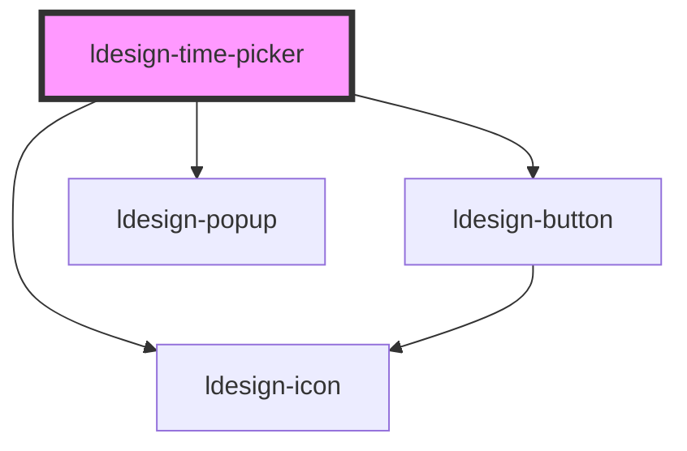

# ldesign-time-picker

<!-- Auto Generated Below -->

## Overview

TimePicker 时间选择器
- 使用 <ldesign-popup> 作为弹层
- 默认格式 HH:mm:ss，可通过 showSeconds 控制秒列

## Properties

| Property               | Attribute                  | Description                                          | Type                                                                                                                                                                 | Default          |
| ---------------------- | -------------------------- | ---------------------------------------------------- | -------------------------------------------------------------------------------------------------------------------------------------------------------------------- | ---------------- |
| `allowInput`           | `allow-input`              | 是否允许键盘输入                                             | `boolean`                                                                                                                                                            | `true`           |
| `arrow`                | `arrow`                    | 是否显示箭头（透传给 Popup）                                    | `boolean`                                                                                                                                                            | `false`          |
| `borderless`           | `borderless`               | 无边框模式                                                | `boolean`                                                                                                                                                            | `false`          |
| `clearable`            | `clearable`                | 是否可清空                                                | `boolean`                                                                                                                                                            | `false`          |
| `confirm`              | `confirm`                  | 是否需要点击“确定”确认（默认需要）。关闭后再触发 change                     | `boolean`                                                                                                                                                            | `true`           |
| `defaultValue`         | `default-value`            | 默认值（非受控）                                             | `string`                                                                                                                                                             | `undefined`      |
| `disabled`             | `disabled`                 | 是否禁用                                                 | `boolean`                                                                                                                                                            | `false`          |
| `disabledHours`        | `disabled-hours`           | 禁用小时集合（可传 JSON 字符串或数组），如 [0,1,2]                     | `number[] \| string`                                                                                                                                                 | `undefined`      |
| `disabledMinutes`      | `disabled-minutes`         | 禁用分钟集合（同上）                                           | `number[] \| string`                                                                                                                                                 | `undefined`      |
| `disabledSeconds`      | `disabled-seconds`         | 禁用秒集合（同上）                                            | `number[] \| string`                                                                                                                                                 | `undefined`      |
| `format`               | `format`                   | 时间格式                                                 | `"HH:mm" \| "HH:mm:ss" \| "HH:mm:ss:SSS" \| "hh:mm A" \| "hh:mm:ss A"`                                                                                               | `'HH:mm:ss'`     |
| `hideDisabledTime`     | `hide-disabled-time`       | 是否隐藏禁用的时间                                            | `boolean`                                                                                                                                                            | `true`           |
| `hourStep`             | `hour-step`                | 步进                                                   | `number`                                                                                                                                                             | `1`              |
| `maxTime`              | `max-time`                 | 最大时间（含），如 18:00 或 18:00:00                           | `string`                                                                                                                                                             | `undefined`      |
| `millisecondStep`      | `millisecond-step`         | 毫秒步进                                                 | `number`                                                                                                                                                             | `1`              |
| `minTime`              | `min-time`                 | 最小时间（含），如 08:30 或 08:30:00                           | `string`                                                                                                                                                             | `undefined`      |
| `minuteStep`           | `minute-step`              |                                                      | `number`                                                                                                                                                             | `1`              |
| `outputFormat`         | `output-format`            | 输出格式：'24' -> 24 小时制；'12' -> 12 小时制（hh:mm[:ss] AM/PM） | `"12" \| "24"`                                                                                                                                                       | `'24'`           |
| `panelHeight`          | `panel-height`             | 列表最大高度                                               | `number`                                                                                                                                                             | `180`            |
| `placeholder`          | `placeholder`              | 占位文案                                                 | `string`                                                                                                                                                             | `'选择时间'`         |
| `placement`            | `placement`                | 弹出层位置                                                | `"bottom" \| "bottom-end" \| "bottom-start" \| "left" \| "left-end" \| "left-start" \| "right" \| "right-end" \| "right-start" \| "top" \| "top-end" \| "top-start"` | `'bottom-start'` |
| `presets`              | `presets`                  | 预设快捷选项（JSON字符串或对象）                                   | `TimePickerPresets \| string`                                                                                                                                        | `undefined`      |
| `readonly`             | `readonly`                 | 是否只读                                                 | `boolean`                                                                                                                                                            | `false`          |
| `secondStep`           | `second-step`              |                                                      | `number`                                                                                                                                                             | `1`              |
| `showClearIconOnEmpty` | `show-clear-icon-on-empty` | 是否在值为空时显示清除图标                                        | `boolean`                                                                                                                                                            | `false`          |
| `showSeconds`          | `show-seconds`             | 是否显示秒                                                | `boolean`                                                                                                                                                            | `true`           |
| `size`                 | `size`                     | 组件尺寸                                                 | `"large" \| "medium" \| "small"`                                                                                                                                     | `'medium'`       |
| `status`               | `status`                   | 状态                                                   | `"default" \| "error" \| "success" \| "warning"`                                                                                                                     | `'default'`      |
| `steps`                | `steps`                    | 步进 [小时, 分钟, 秒]                                       | `number[]`                                                                                                                                                           | `[1, 1, 1]`      |
| `theme`                | `theme`                    | 主题（透传给 Popup）                                        | `"dark" \| "light"`                                                                                                                                                  | `'light'`        |
| `trigger`              | `trigger`                  | 弹出层触发方式                                              | `"click" \| "focus" \| "manual"`                                                                                                                                     | `'click'`        |
| `use12Hours`           | `use-1-2-hours`            | 是否显示 12 小时制 AM/PM 列（显示方式），内部仍以 24h 保存                | `boolean`                                                                                                                                                            | `false`          |
| `value`                | `value`                    | 当前值（受控），格式如 23:59:59 或 23:59（当 showSeconds=false 时）  | `string`                                                                                                                                                             | `undefined`      |
| `visible`              | `visible`                  | 外部受控可见性（仅 trigger = 'manual' 生效）                     | `boolean`                                                                                                                                                            | `false`          |
| `visibleItems`         | `visible-items`            | 可视条目数（当未显式指定 panelHeight 时生效）                        | `number`                                                                                                                                                             | `5`              |

## Events

| Event                  | Description       | Type                                                                                                 |
| ---------------------- | ----------------- | ---------------------------------------------------------------------------------------------------- |
| `ldesignBlur`          | 输入框失去焦点           | `CustomEvent<FocusEvent>`                                                                            |
| `ldesignChange`        | 值改变               | `CustomEvent<string>`                                                                                |
| `ldesignClose`         | 面板关闭              | `CustomEvent<void>`                                                                                  |
| `ldesignFocus`         | 输入框获得焦点           | `CustomEvent<FocusEvent>`                                                                            |
| `ldesignOpen`          | 面板打开              | `CustomEvent<void>`                                                                                  |
| `ldesignPick`          | 选择时间（点击、滚动、键盘操作时） | `CustomEvent<{ value: string; context: { trigger: "scroll" \| "click" \| "keyboard" \| "now"; }; }>` |
| `ldesignVisibleChange` | 弹层可见性改变           | `CustomEvent<boolean>`                                                                               |

## Dependencies

### Depends on

- [ldesign-icon](../icon)
- [ldesign-button](../button)
- [ldesign-popup](../popup)

### Graph

----------------------------------------------

*Built with [StencilJS](https://stenciljs.com/)*
