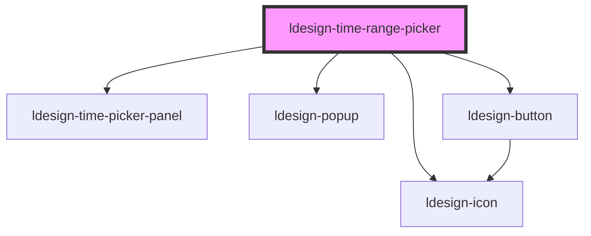

# ldesign-time-range-picker

<!-- Auto Generated Below -->

## Properties

| Property               | Attribute                  | Description | Type                                                                                                                                                                 | Default          |
| ---------------------- | -------------------------- | ----------- | -------------------------------------------------------------------------------------------------------------------------------------------------------------------- | ---------------- |
| `allowInput`           | `allow-input`              |             | `boolean`                                                                                                                                                            | `true`           |
| `arrow`                | `arrow`                    |             | `boolean`                                                                                                                                                            | `false`          |
| `borderless`           | `borderless`               |             | `boolean`                                                                                                                                                            | `false`          |
| `clearable`            | `clearable`                |             | `boolean`                                                                                                                                                            | `true`           |
| `confirm`              | `confirm`                  |             | `boolean`                                                                                                                                                            | `true`           |
| `defaultValue`         | `default-value`            |             | `[string, string]`                                                                                                                                                   | `undefined`      |
| `disabled`             | `disabled`                 |             | `boolean`                                                                                                                                                            | `false`          |
| `format`               | `format`                   |             | `"HH:mm" \| "HH:mm:ss" \| "HH:mm:ss:SSS" \| "hh:mm A" \| "hh:mm:ss A"`                                                                                               | `'HH:mm:ss'`     |
| `hideDisabledTime`     | `hide-disabled-time`       |             | `boolean`                                                                                                                                                            | `true`           |
| `panelHeight`          | `panel-height`             |             | `number`                                                                                                                                                             | `180`            |
| `placeholderEnd`       | `placeholder-end`          |             | `string`                                                                                                                                                             | `'结束时间'`         |
| `placeholderStart`     | `placeholder-start`        |             | `string`                                                                                                                                                             | `'开始时间'`         |
| `placement`            | `placement`                |             | `"bottom" \| "bottom-end" \| "bottom-start" \| "left" \| "left-end" \| "left-start" \| "right" \| "right-end" \| "right-start" \| "top" \| "top-end" \| "top-start"` | `'bottom-start'` |
| `presets`              | `presets`                  |             | `string \| { [x: string]: TimeRange; }`                                                                                                                              | `undefined`      |
| `readonly`             | `readonly`                 |             | `boolean`                                                                                                                                                            | `false`          |
| `showClearIconOnEmpty` | `show-clear-icon-on-empty` |             | `boolean`                                                                                                                                                            | `false`          |
| `size`                 | `size`                     |             | `"large" \| "medium" \| "small"`                                                                                                                                     | `'medium'`       |
| `status`               | `status`                   |             | `"default" \| "error" \| "success" \| "warning"`                                                                                                                     | `'default'`      |
| `steps`                | `steps`                    |             | `number[]`                                                                                                                                                           | `[1, 1, 1, 1]`   |
| `theme`                | `theme`                    |             | `"dark" \| "light"`                                                                                                                                                  | `'light'`        |
| `trigger`              | `trigger`                  |             | `"click" \| "focus" \| "manual"`                                                                                                                                     | `'click'`        |
| `value`                | `value`                    |             | `[string, string]`                                                                                                                                                   | `undefined`      |
| `visible`              | `visible`                  |             | `boolean`                                                                                                                                                            | `false`          |

## Events

| Event                  | Description | Type                                                                                                    |
| ---------------------- | ----------- | ------------------------------------------------------------------------------------------------------- |
| `ldesignBlur`          |             | `CustomEvent<FocusEvent>`                                                                               |
| `ldesignChange`        |             | `CustomEvent<[string, string]>`                                                                         |
| `ldesignClose`         |             | `CustomEvent<void>`                                                                                     |
| `ldesignFocus`         |             | `CustomEvent<FocusEvent>`                                                                               |
| `ldesignOpen`          |             | `CustomEvent<void>`                                                                                     |
| `ldesignPick`          |             | `CustomEvent<{ value: TimeRange; context: { trigger: "scroll" \| "click" \| "keyboard" \| "now"; }; }>` |
| `ldesignVisibleChange` |             | `CustomEvent<boolean>`                                                                                  |

## Dependencies

### Depends on

- [ldesign-time-picker-panel](../time-picker-panel)
- [ldesign-icon](../icon)
- [ldesign-popup](../popup)
- [ldesign-button](../button)

### Graph

----------------------------------------------

*Built with [StencilJS](https://stenciljs.com/)*
