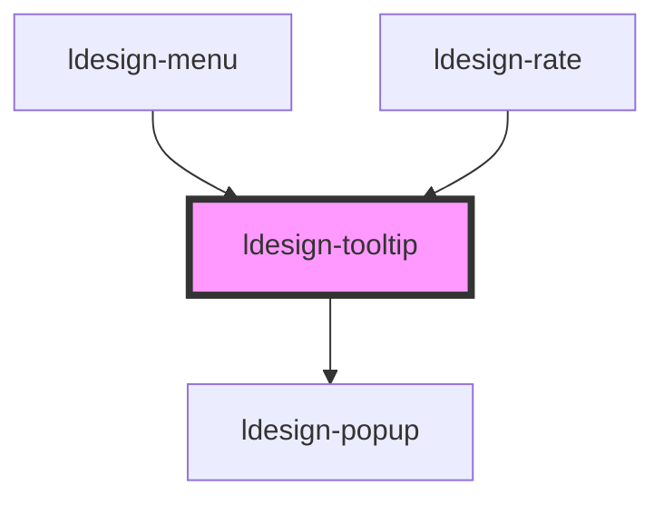

# ldesign-tooltip

<!-- Auto Generated Below -->

## Overview

Tooltip 工具提示组件
基于 Popup 的轻量封装

## Properties

| Property               | Attribute         | Description               | Type                                                                                                                                                                 | Default     |
| ---------------------- | ----------------- | ------------------------- | -------------------------------------------------------------------------------------------------------------------------------------------------------------------- | ----------- |
| `arrow`                | `arrow`           | 是否显示箭头                    | `boolean`                                                                                                                                                            | `true`      |
| `content` _(required)_ | `content`         | 提示内容                      | `string`                                                                                                                                                             | `undefined` |
| `disabled`             | `disabled`        | 是否禁用                      | `boolean`                                                                                                                                                            | `false`     |
| `hideDelay`            | `hide-delay`      | 延迟隐藏时间（毫秒）                | `number`                                                                                                                                                             | `100`       |
| `maxWidth`             | `max-width`       | 最大宽度                      | `number`                                                                                                                                                             | `250`       |
| `offsetDistance`       | `offset-distance` | 与触发元素的间距（默认 tooltip 更大一些） | `number \| string`                                                                                                                                                   | `16`        |
| `placement`            | `placement`       | 提示位置                      | `"bottom" \| "bottom-end" \| "bottom-start" \| "left" \| "left-end" \| "left-start" \| "right" \| "right-end" \| "right-start" \| "top" \| "top-end" \| "top-start"` | `'top'`     |
| `showDelay`            | `show-delay`      | 延迟显示时间（毫秒）                | `number`                                                                                                                                                             | `100`       |
| `theme`                | `theme`           | 主题：深色/浅色（默认深色）            | `"dark" \| "light"`                                                                                                                                                  | `'dark'`    |

## Dependencies

### Used by

 - [ldesign-menu](../menu)
 - [ldesign-rate](../rate)

### Depends on

- [ldesign-popup](../popup)

### Graph

----------------------------------------------

*Built with [StencilJS](https://stenciljs.com/)*
